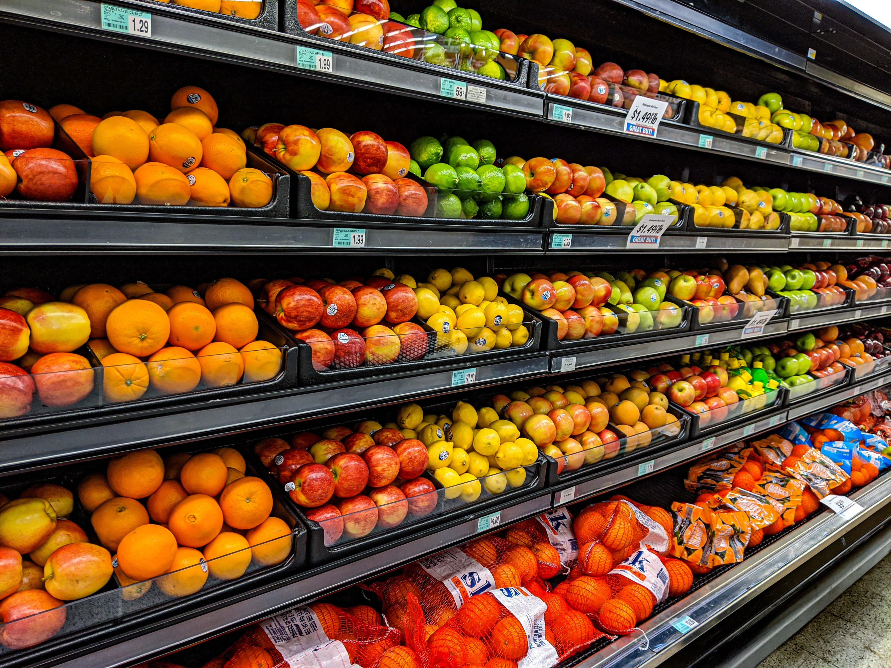

# 
Walmart: predict weekly sales

  

## Context 

Walmart Inc. is an American multinational retail corporation that operates a chain of hypermarkets, discount department stores, and grocery stores. Walmart's marketing service would like to have a machine learning model able to estimate the weekly sales in their stores. Such a model would help them understand better how the sales are influenced by economic indicators, and might be used to plan future marketing campaigns.

The dataset provided for this projet contains information about weekly sales achieved by different Walmart stores, and other variables such as the unemployment rate or the fuel price that might be useful for predicting the amount of sales.

The dataset (.csv file) is included in project folder. 

## Goals of the project
 - Explore the dataset and create come data visualisations
 - Train a baseline linear regression model
 - Train a regularized regression model

## References

- [Walmart Dataset on Kaggle](https://www.kaggle.com/datasets/yasserh/walmart-dataset) (The dataset used in this project is based on the Kaggle dataset with modifications by Jedha).

- Photo by <a href="https://unsplash.com/@_gemmajade?utm_source=unsplash&utm_medium=referral&utm_content=creditCopyText">gemma</a> on <a href="https://unsplash.com/photos/stpjHJGqZyw?utm_source=unsplash&utm_medium=referral&utm_content=creditCopyText">Unsplash</a>
  